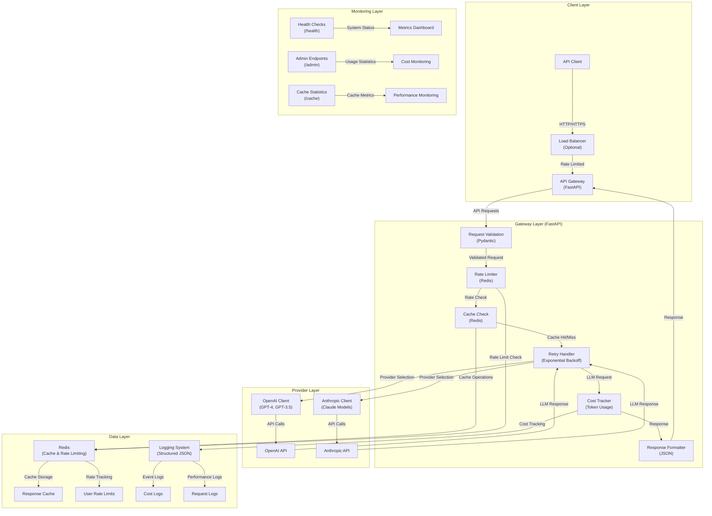
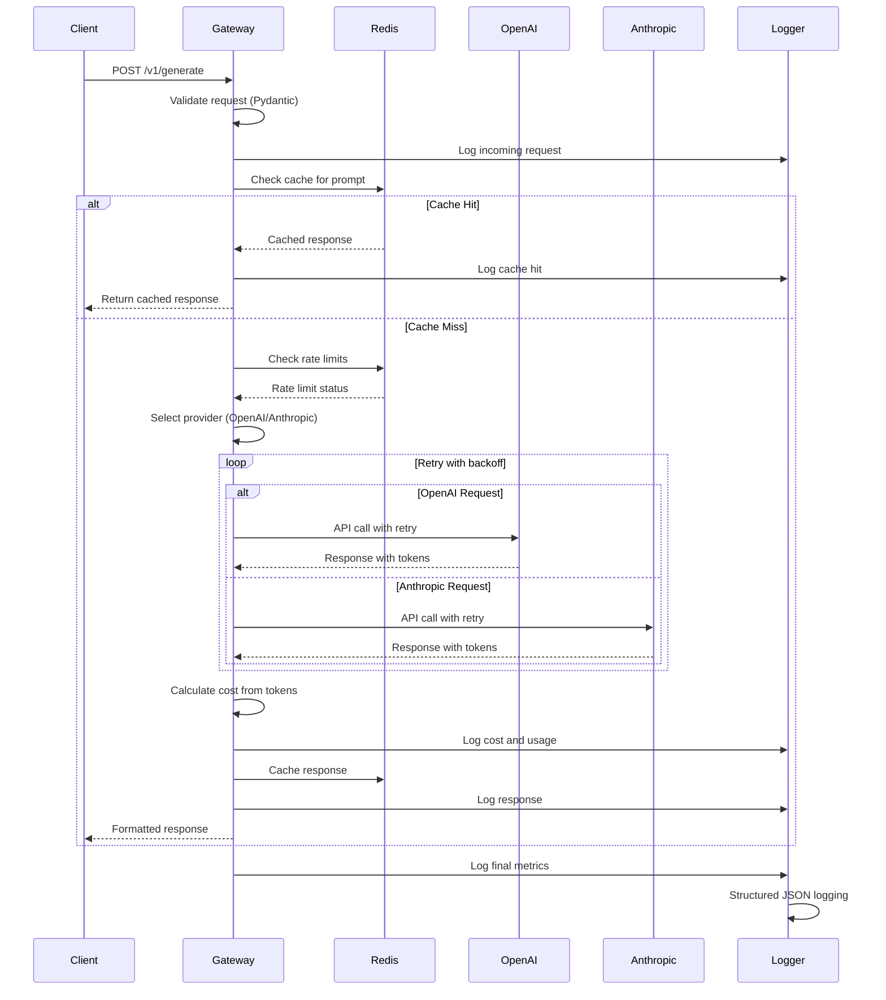

# LLM Gateway API

A production-grade API gateway for LLM providers (OpenAI, Anthropic) with retry logic, cost control, rate limiting, caching, and comprehensive logging. Built with FastAPI and Redis for high-performance, scalable LLM API management.

---

## Architecture



---

## System Overview

LLM Gateway API implements a robust, production-ready architecture with comprehensive error handling, cost control, and observability across five main layers:

### **Client Layer**

- **API Clients**: RESTful HTTP clients with proper authentication and rate limiting
- **Load Balancing**: Optional load balancer for horizontal scaling
- **Request Validation**: Automatic input validation and sanitization
- **Response Formatting**: Consistent JSON responses with metadata

### **Gateway Layer**

- **Request Processing**: FastAPI-based request handling with Pydantic validation
- **Rate Limiting**: Per-user rate limiting with sliding window implementation
- **Caching**: Redis-based response caching to reduce API calls and costs
- **Retry Logic**: Exponential backoff with jitter for transient failures
- **Cost Tracking**: Real-time token usage and cost monitoring
- **Error Handling**: Comprehensive error handling with proper HTTP status codes

### **Provider Layer**

- **Multi-Provider Support**: Unified interface for OpenAI and Anthropic APIs
- **Model Routing**: Automatic routing based on model selection
- **Provider Fallback**: Graceful handling of provider-specific errors
- **Token Estimation**: Accurate token counting and cost calculation

### **Data Layer**

- **Redis Cache**: High-performance caching for LLM responses
- **Rate Limit Storage**: Distributed rate limiting with Redis
- **Structured Logging**: JSON-formatted logs for observability
- **Cost Tracking**: Persistent cost and usage statistics

### **Monitoring Layer**

- **Health Checks**: Comprehensive system health monitoring
- **Admin Dashboard**: Usage statistics and cost monitoring
- **Performance Metrics**: Response times and cache hit rates
- **Error Tracking**: Detailed error logging and alerting

The system supports multiple user types:

1. **API Consumers**: External applications making LLM requests
2. **Admin Users**: System administrators monitoring usage and costs
3. **Monitoring Systems**: Health checks and metrics collection

---

## Data Flow



---

## Features

### **Core Functionality**

- **Multi-Provider Support**: Unified interface for OpenAI (GPT-4, GPT-3.5) and Anthropic (Claude) APIs
- **Intelligent Retry Logic**: Exponential backoff with jitter for transient failures
- **Advanced Rate Limiting**: Per-user rate limiting with sliding window implementation
- **Cost Control**: Real-time token usage tracking and cost monitoring
- **Response Caching**: Redis-based caching to reduce API calls and improve performance

### **Production Features**

- **Structured Logging**: JSON-formatted logs with comprehensive request/response tracking
- **Health Monitoring**: Comprehensive health checks with Redis connectivity testing
- **Admin Dashboard**: Usage statistics, cost monitoring, and system metrics
- **Error Handling**: Graceful error handling with proper HTTP status codes
- **Security**: Input validation, rate limiting, and secure error responses

### **Scalability & Performance**

- **Horizontal Scaling**: Stateless design allows multiple instances behind load balancer
- **Redis Integration**: Distributed caching and rate limiting
- **Async Processing**: Non-blocking request handling with FastAPI
- **Performance Metrics**: Response time tracking and cache hit rate monitoring

### **Developer Experience**

- **Interactive Documentation**: Auto-generated API docs with OpenAPI/Swagger
- **Type Safety**: Full Pydantic validation for all requests and responses
- **Comprehensive Testing**: Unit and integration tests with mocking
- **Docker Support**: Production-ready containerization with health checks

### **Monitoring & Observability**

- **Request Tracking**: Unique request IDs for end-to-end tracing
- **Cost Analytics**: Per-user and per-model cost breakdown
- **Performance Metrics**: Latency tracking and cache statistics
- **Error Monitoring**: Detailed error logging with context

---

## API Endpoints

### **Core Endpoints**

| Endpoint       | Method | Description                                |
| -------------- | ------ | ------------------------------------------ |
| `/v1/generate` | POST   | Generate text using specified LLM model    |
| `/v1/health`   | GET    | System health check with Redis status      |
| `/v1/models`   | GET    | List available models and cost information |

### **Monitoring Endpoints**

| Endpoint                   | Method | Description                      |
| -------------------------- | ------ | -------------------------------- |
| `/v1/usage/{user_id}`      | GET    | Get usage statistics for user    |
| `/v1/rate-limit/{user_id}` | GET    | Get rate limit information       |
| `/v1/cache/stats`          | GET    | Get cache statistics             |
| `/v1/cache/clear`          | DELETE | Clear all cached responses       |
| `/v1/admin/summary`        | GET    | Get comprehensive system summary |

### **Request Example**

```bash
curl -X POST "http://localhost:8000/v1/generate" \
  -H "Content-Type: application/json" \
  -d '{
    "prompt": "Explain transformers in machine learning",
    "model": "gpt-4",
    "temperature": 0.7,
    "user_id": "user123"
  }'
```

### **Response Example**

```json
{
  "completion": "Transformers are a type of neural network architecture...",
  "model": "gpt-4",
  "total_tokens": 150,
  "prompt_tokens": 50,
  "completion_tokens": 100,
  "cost_usd": 0.0045,
  "request_id": "uuid-here",
  "cached": false,
  "latency_ms": 1250.5
}
```

---

## Installation & Setup

### **Prerequisites**

- Python 3.10+
- Redis server
- OpenAI API key (required)
- Anthropic API key (optional)

### **Quick Start**

```bash
# 1. Clone repository
git clone <repository-url>
cd llm-gateway

# 2. Install dependencies
pip install -r requirements.txt

# 3. Configure environment
cp env.example .env
# Edit .env with your API keys

# 4. Start Redis
docker run -d -p 6379:6379 redis:7-alpine

# 5. Run the API
uvicorn app.main:app --reload
```

### **Docker Deployment**

```bash
# Using Docker Compose (recommended)
docker-compose up -d

# Or build and run manually
docker build -t llm-gateway .
docker run -p 8000:8000 \
  -e OPENAI_API_KEY=your_key \
  -e REDIS_URL=redis://host.docker.internal:6379 \
  llm-gateway
```

---

## Configuration

### **Environment Variables**

| Variable                  | Description           | Default                  |
| ------------------------- | --------------------- | ------------------------ |
| `OPENAI_API_KEY`          | OpenAI API key        | Required                 |
| `ANTHROPIC_API_KEY`       | Anthropic API key     | Optional                 |
| `REDIS_URL`               | Redis connection URL  | `redis://localhost:6379` |
| `MAX_REQUESTS_PER_MINUTE` | Rate limit per minute | `10`                     |
| `MAX_REQUESTS_PER_HOUR`   | Rate limit per hour   | `100`                    |
| `CACHE_TTL_SECONDS`       | Cache TTL             | `3600`                   |
| `LOG_LEVEL`               | Logging level         | `INFO`                   |

### **Cost Configuration**

Token costs are configurable per model:

```env
COST_PER_TOKEN_GPT4=0.00003
COST_PER_TOKEN_GPT35=0.000002
COST_PER_TOKEN_CLAUDE=0.000015
```

---

## Testing

### **Run Tests**

```bash
# All tests
pytest

# Unit tests only
pytest tests/unit/

# Integration tests only
pytest tests/integration/

# With coverage
pytest --cov=app tests/
```

### **Test API**

```bash
# Run the test script
python scripts/test_api.py
```

---

## Monitoring & Observability

### **Health Checks**

- `/health` - Basic health check
- `/v1/health` - Detailed health with Redis status

### **Metrics to Monitor**

- **Request Rate**: Requests per minute/hour
- **Cost Metrics**: Total and per-user costs
- **Performance**: Response times and latency
- **Cache Efficiency**: Hit rate and cache size
- **Error Rate**: Failed requests and error types
- **Token Usage**: Total tokens consumed

### **Logging**

The system uses structured JSON logging with the following event types:

- `request_received` - Incoming request details
- `response_generated` - Response with cost and performance data
- `cache_hit` - Cache hit events
- `rate_limit_exceeded` - Rate limit violations
- `cost_tracked` - Cost tracking information
- `request_failed` - Error details with context

---

## Production Deployment

### **Environment Setup**

1. **Redis Cluster**: Set up Redis Cluster for high availability
2. **Load Balancer**: Configure nginx or similar for SSL termination
3. **Monitoring**: Set up Prometheus + Grafana for metrics
4. **Logging**: Configure ELK stack or similar for log aggregation
5. **Security**: Configure proper CORS and API key management

### **Scaling Considerations**

- **Horizontal Scaling**: Deploy multiple API instances behind load balancer
- **Redis Cluster**: Use Redis Cluster for distributed caching
- **Database**: Consider adding PostgreSQL for persistent cost tracking
- **CDN**: Use CDN for static assets and API documentation

### **Security Best Practices**

- **API Keys**: Store securely using environment variables or secret management
- **Rate Limiting**: Configure appropriate limits to prevent abuse
- **Input Validation**: All inputs are validated with Pydantic
- **Error Handling**: Sensitive information is not exposed in error responses
- **CORS**: Configure CORS appropriately for production domains

---

## Project Structure

```
llm-gateway/
├── app/
│   ├── api/v1/              # API endpoints and schemas
│   │   ├── endpoints.py     # Route handlers
│   │   └── schemas.py       # Pydantic models
│   ├── core/                # Core functionality
│   │   ├── config.py        # Configuration management
│   │   ├── logging.py       # Structured logging
│   │   ├── cache.py         # Redis caching
│   │   ├── rate_limiter.py  # Rate limiting
│   │   ├── retry.py         # Retry logic
│   │   └── cost_tracker.py  # Cost tracking
│   ├── services/            # External service clients
│   │   └── llm_client.py    # LLM provider clients
│   └── main.py              # FastAPI application
├── tests/                   # Test suite
│   ├── unit/                # Unit tests
│   └── integration/         # Integration tests
├── scripts/                 # Utility scripts
│   └── test_api.py          # API test script
├── Dockerfile               # Production container
├── docker-compose.yml       # Local development
├── requirements.txt         # Python dependencies
└── README.md               # This documentation
```

---

## Contributing

1. Fork the repository
2. Create a feature branch (`git checkout -b feature/amazing-feature`)
3. Make your changes with proper tests
4. Commit your changes (`git commit -m 'Add amazing feature'`)
5. Push to the branch (`git push origin feature/amazing-feature`)
6. Open a Pull Request

## License

This project is licensed under the MIT License - see the LICENSE file for details.

## Acknowledgments

- **FastAPI** for the excellent web framework
- **Redis** for caching and rate limiting
- **OpenAI** and **Anthropic** for their LLM APIs
- **Pydantic** for data validation and serialization
