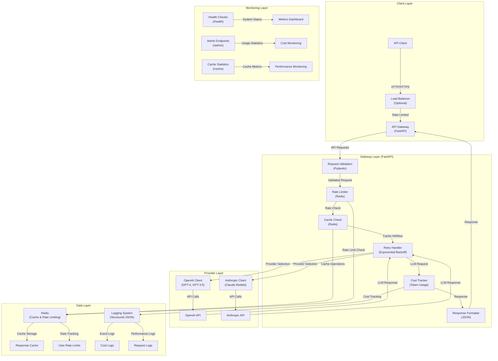
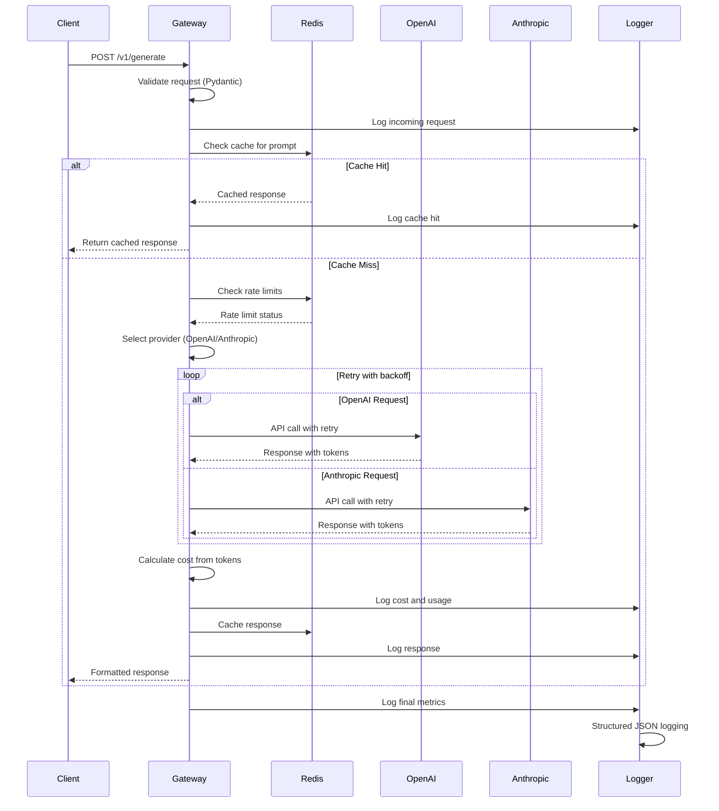

# LLM Gateway API

A production-grade API gateway for LLM providers (OpenAI, Anthropic) with retry logic, cost control, rate limiting, caching, and comprehensive logging. Built with FastAPI and Redis for high-performance, scalable LLM API management.

---

## Architecture

---

## System Overview

LLM Gateway API implements a robust, production-ready architecture with comprehensive error handling, cost control, and observability across five main layers:

### **Client Layer**

- **API Clients**: RESTful HTTP clients with proper authentication and rate limiting
- **Load Balancing**: Optional load balancer for horizontal scaling
- **Request Validation**: Automatic input validation and sanitization
- **Response Formatting**: Consistent JSON responses with metadata

### **Gateway Layer**

- **Request Processing**: FastAPI-based request handling with Pydantic validation
- **Rate Limiting**: Per-user rate limiting with sliding window implementation
- **Caching**: Redis-based response caching to reduce API calls and costs
- **Retry Logic**: Exponential backoff with jitter for transient failures
- **Cost Tracking**: Real-time token usage and cost monitoring
- **Error Handling**: Comprehensive error handling with proper HTTP status codes

### **Provider Layer**

- **Multi-Provider Support**: Unified interface for OpenAI and Anthropic APIs
- **Model Routing**: Automatic routing based on model selection
- **Provider Fallback**: Graceful handling of provider-specific errors
- **Token Estimation**: Accurate token counting and cost calculation

### **Data Layer**

- **Redis Cache**: High-performance caching for LLM responses
- **Rate Limit Storage**: Distributed rate limiting with Redis
- **Structured Logging**: JSON-formatted logs for observability
- **Cost Tracking**: Persistent cost and usage statistics

### **Monitoring Layer**

- **Health Checks**: Comprehensive system health monitoring
- **Admin Dashboard**: Usage statistics and cost monitoring
- **Performance Metrics**: Response times and cache hit rates
- **Error Tracking**: Detailed error logging and alerting

The system supports multiple user types:

1. **API Consumers**: External applications making LLM requests
2. **Admin Users**: System administrators monitoring usage and costs
3. **Monitoring Systems**: Health checks and metrics collection

---

## Data Flow

---

## Features

### **Core Functionality**

- **Multi-Provider Support**: Unified interface for OpenAI (GPT-4, GPT-3.5) and Anthropic (Claude) APIs
- **Intelligent Retry Logic**: Exponential backoff with jitter for transient failures
- **Advanced Rate Limiting**: Per-user rate limiting with sliding window implementation
- **Cost Control**: Real-time token usage tracking and cost monitoring
- **Response Caching**: Redis-based caching to reduce API calls and improve performance

### **Production Features**

- **Structured Logging**: JSON-formatted logs with comprehensive request/response tracking
- **Health Monitoring**: Comprehensive health checks with Redis connectivity testing
- **Admin Dashboard**: Usage statistics, cost monitoring, and system metrics
- **Error Handling**: Graceful error handling with proper HTTP status codes
- **Security**: Input validation, rate limiting, and secure error responses

### **Scalability & Performance**

- **Horizontal Scaling**: Stateless design allows multiple instances behind load balancer
- **Redis Integration**: Distributed caching and rate limiting
- **Async Processing**: Non-blocking request handling with FastAPI
- **Performance Metrics**: Response time tracking and cache hit rate monitoring

### **Developer Experience**

- **Interactive Documentation**: Auto-generated API docs with OpenAPI/Swagger
- **Type Safety**: Full Pydantic validation for all requests and responses
- **Comprehensive Testing**: Unit and integration tests with mocking
- **Docker Support**: Production-ready containerization with health checks

### **Monitoring & Observability**

- **Request Tracking**: Unique request IDs for end-to-end tracing
- **Cost Analytics**: Per-user and per-model cost breakdown
- **Performance Metrics**: Latency tracking and cache statistics
- **Error Monitoring**: Detailed error logging with context
